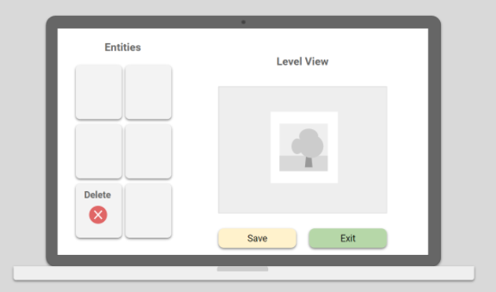

# **Penguin Sledding - Final Design**

## IT 276: 2D Game Development

### 1. Description

*   **Deliverable:** The aim is to deliver a 2D top-down scrolling video game about a penguin sledding down a slope. Avoid obstacles, collect fish, and unlock playable characters along the way!
*   **Motivation** I think a penguin sledding game is a pretty fun and simple idea. I wanted something more wholesome in contrast to the action-packed video games that make up a large part of the market.
*   **Technical Approach** The game will be built entirely in C and will use the SDL2 library. It will be built on the 2D game engine framework we’ve been learning in class. [https://github.com/engineerOfLies/gameframework2d](https://github.com/engineerOfLies/gameframework2d) The game will feature open-source art assets from online sources such as [https://opengameart.org/](https://opengameart.org/)

### 2. Dependencies & Risks

*   I’ve worked with C before, but have never built something on this scale with it. I’m expecting that it will take some time to get comfortable with the language, and that it will be a learning process all the way through to the end.
*   After a cursory search, there are a limited number of open-source art assets that fit the game’s theme. I’m expecting to spend some time getting all the art assets that fit well, and in the end may have to make some compromises.
*   Since C is a very flexible and powerful language, there are many ways to accomplish the same goal. I’ll have to be mindful when choosing my techniques to avoid potential bugs or performance issues later down the line.
*   The “Infinite Level” will likely prove to be a challenge. I should allocate enough time to make sure I can ask the professor for help when developing it and still have enough time to complete the rest of the game.

### 3. Sprint Milestones

*   **Sprint 1 - Prototype**: The base of the app is the core game functionality will be implemented. This version will be unpolished and will function more of a prototype and game’s core mechanics.
*   **Sprint 2 - MVP:** Building on the Sprint 1, this version will feature a more fleshed out version of the game. The levels will feel more complete, and the game will have features implemented such as unlockable characters, a level selector, secret levels, different interactions with obstacles, and an in-game level creator.
*   **Sprint 3 - Polish:** This version of the game will be a more polished version of the MVP. Any unused code or libraries will be removed, art assets will be finalized, music and sound effects will be finalized, and a level of beautification to the game will be applied. These will be simple finishing touches.

### 4. Sprint 2 User Stories 

1. **As a regular user, I should be able to make use of a pause button in game**
    1. The pause button should have options such as resume and exit to main menu
    2. The game will automatically save the player’s current score upon exit
2. **As a regular user, I should be able to interact with obstacles in interesting ways**
    1. Brainstorm w/ Professor about this
3. **As a regular user, I should be able to select a level from the level selector**
    1. The level selector should be an option in the main menu
    2. Once selected, I’m taken to a screen where I can choose a level
    3. There should be two columns, one column displaying prebuilt and levels and the other column showing custom levels
    4. When selecting a level, I should see an option to load the level along with the current high score for that level
    5. There should also be a load level option which will load the level when selected
4. **As a regular user, I should be able to unlock secret levels**
    1. One rare collectable is present in some of the prebuilt non-secret levels for me to find
    2. Upon collecting one, the new secret level will be available in the main menu screen
5. **As a regular user, I should be able to create a custom level using the level editor**
    1. The level editor should be an option in the main menu
    2. When selected, I’ll be taken to a blank level with the default backdrop
    3. I’ll be able to pick from a list of obstacles and power ups.
    4. Once I select one, I can choose where to place it in the level
    5. Once I save the level, the level will be saved in json format in the game’s level directory.
6. **As a regular user, I should be able to unlock more penguins**
    1. After completing a secret level, one of the unlockable penguins will be available to play
    2. The penguin can be selected from the penguin selector
    3. There should be at least three unlockable penguins
7. **As a regular user, I should be able to select which penguin I want to play as**
    1. The penguin selector should be an option on the main menu
    2. Once selected, I’m presented with a list of penguins that I currently have unlocked
    3. Each option will show the art for each penguin along with a description of its unique ability
    4. Upon selecting a penguin, I will play as that penguin in all levels until another penguin is selected.
8. **As a regular user, I should be able to select the infinite level from the level selector**
    1. The level will load in “chunks”. The game will load these chunks as the player progresses through the level
    2. There will be a list of pre-generated level “chunks” available to choose from.
    3. The player must exit via the pause menu to leave the level
9. **Persistent Upgrades (per profile)**
    1. Clarify w/ professor for more details about this
10. **As a regular user, I should be able to hear music and audio while playing**
    1. Music during the level and main menu
    2. Sound effects for sledding
    3. Sound effects for collecting items
    4. Sound effects for interacting with obstacles
11. **As a regular user, I should be able to create and select different profiles**
    1. Profile selector is an option on the main menu
    2. There should an option to create a profile
    3. There should be a list of currently existing profiles
    4. Upon selecting one, there should be an option to select or delete the profile

### 6. Design Mocks

1. **Main menu**

2. **Level Creator**

